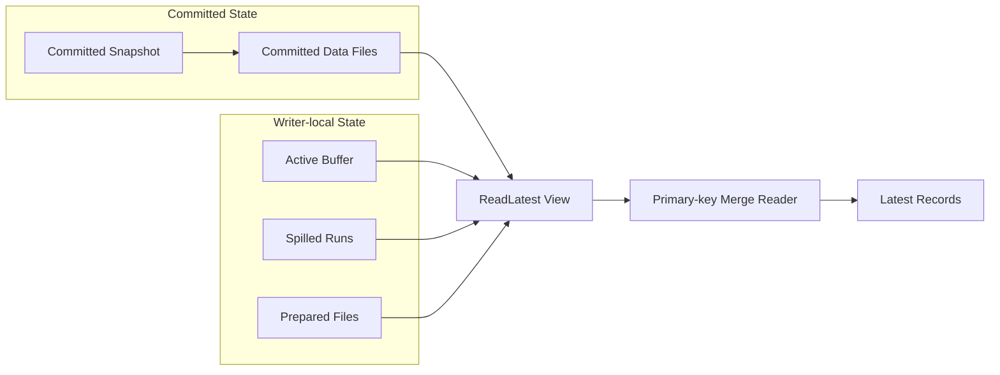
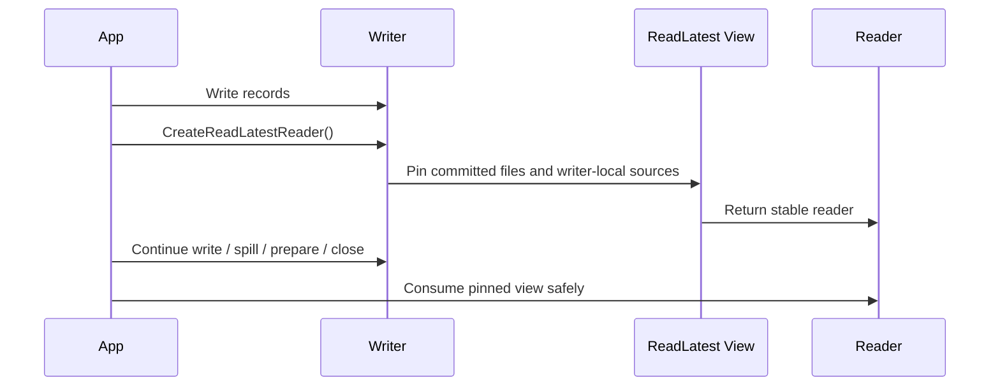

<!---
  Copyright 2026-present Alibaba Inc.

  Licensed under the Apache License, Version 2.0 (the "License");
  you may not use this file except in compliance with the License.
  You may obtain a copy of the License at

    http://www.apache.org/licenses/LICENSE-2.0

  Unless required by applicable law or agreed to in writing, software
  distributed under the License is distributed on an "AS IS" BASIS,
  WITHOUT WARRANTIES OR CONDITIONS OF ANY KIND, either express or implied.
  See the License for the specific language governing permissions and
  limitations under the License.
-->

# [Proposal] Add Writer-local ReadLatest Support to Paimon C++

## 1. Motivation

Paimon C++ writers already keep intermediate state before committing a snapshot. Records may stay
in the active write buffer, be spilled into sorted runs, or be written as prepared files before the
final snapshot commit.

For embedded C++ applications, it is useful to read the latest state accepted by a writer before
the snapshot is committed. Typical examples include validation and read-after-write flows owned by
the same process. Today, applications that need this behavior usually maintain an external side
buffer and duplicate merge logic outside Paimon.

That approach becomes hard to keep correct once the writer spills data or prepares files. The
application has to know which data is still in memory, which data has been spilled, which data has
been prepared, and how to merge those records with committed snapshot files. This duplicates
behavior that already belongs to Paimon.

The proposed change exposes this state through a controlled writer-local read API, while preserving
Paimon's normal snapshot isolation for committed readers.

## 2. Scope

This proposal targets **primary-key tables** in the first phase.

`ReadLatest` depends on primary-key merge semantics: same-key conflict resolution, sequence
ordering, and delete handling. Append-only tables have different semantics, where repeated records
remain independent appended rows rather than versions of the same key. Append-only table serving
is therefore out of scope for the first phase.

The first phase focuses on correctness and API shape. Recovery from external write-ahead logs and
serving-oriented performance optimization are left as follow-up work.

## 3. Proposed Change

Add a writer-local read path that can create a stable read view from:

- committed snapshot files visible to the writer;
- active in-memory buffer owned by the writer;
- spilled sorted runs owned by the writer;
- prepared files created by the writer before snapshot commit.

The reader returns the latest primary-key result according to Paimon's existing primary-key merge
semantics.



## 4. Public API

The API should be explicit about the visibility model. The proposed naming is `ReadLatest`, not
`ReadUncommitted`, because the feature does not introduce a table-wide isolation level. The names
in the following example are proposed public API and are not present in the current public headers.

```cpp
ReadLatestOptions options;
std::unique_ptr<RecordReader> reader =
    writer->CreateReadLatestReader(options);
```

Expected behavior:

- the API is called on a writer instance;
- it includes data accepted by that writer;
- it does not expose data from other writers;
- it does not make uncommitted data globally visible;
- it does not change existing snapshot readers.

The first implementation is intended to expose a full writer-local read view. Projection and
predicate support should only be added where they can follow existing Paimon scan semantics safely.

## 5. Prototype

A local prototype has been implemented to validate the proposed direction in Paimon C++.

The prototype currently validates fixed-bucket primary-key tables with the deduplicate merge
engine. Deletion vectors, predicates, and other merge engines are outside the validated prototype
surface.

The prototype demonstrates:

- writer-local `ReadLatest` reader for primary-key tables;
- reading records from the active write buffer before snapshot commit;
- reading spilled writer-local sorted runs;
- reading prepared files before snapshot commit;
- merging committed snapshot files with writer-local records;
- correct same-key insert, update, and delete resolution across snapshot files, memory buffer,
  spilled runs, and prepared files;
- stable read view lifetime after later writer operations such as spill, prepare, commit, and close;
- existing snapshot read and commit paths remain unchanged;
- focused tests covering same-key mutations, multiple spills, prepared files, snapshot merge, delete
  handling, read-view lifetime, and failure cleanup.

The prototype is intended to validate API shape and correctness first. It does not claim to solve
crash recovery from external write-ahead logs or serving-oriented performance optimization in the
first phase.

## 6. Semantics

### 6.1 Visibility

`ReadLatest` is writer-local. It observes committed snapshot state plus uncommitted state owned by
the same writer at the time the read view is created.

It is not a global read-uncommitted mode. Other readers continue to see committed snapshots only.

### 6.2 Read View Stability

Once `CreateReadLatestReader()` succeeds, the returned reader must remain readable until it is
destroyed.

Later writer operations may continue:

- write more records;
- spill buffered records;
- prepare commit files;
- commit a snapshot;
- flush or close writer-owned resources.

Those later operations must not invalidate resources already pinned by the read view.

This proposal does not change the writer's existing thread-safety contract. It only requires that
once a read view is created successfully, subsequent writer lifecycle operations must not make the
returned reader dangling.



### 6.3 Primary-key Result

For primary-key tables, the reader returns the latest visible mutation for each key in the read
view.

- If the newest visible mutation is an insert or update, the latest row is returned.
- If the newest visible mutation is a delete, the key is not returned.
- If the same key appears in committed files and writer-local state, the writer-local newer mutation
  wins according to sequence ordering.

All writer-local sources in a read view should use the same sequence ordering as the existing
primary-key writer and merge path. The read path should not introduce an independent ordering rule.

### 6.4 Resource Lifetime

All resources captured by a read view must remain valid until the reader is released. This includes
active buffer snapshots, spilled run readers, committed data files, and prepared files.

Prepared files included in a read view must be retained until the view is released, regardless of
later commit, close, or cleanup operations.

## 7. Compatibility

This proposal is additive.

- Existing snapshot read behavior remains unchanged.
- Existing write, prepare commit, and snapshot commit behavior remains unchanged.
- Existing applications do not need to opt in.
- Applications that need writer-local latest reads can use the new writer API.

The implementation should not introduce additional overhead to the default snapshot read path.

## 8. Implementation Outline

If the community agrees with the direction, the implementation can be submitted incrementally:

1. Expose writer-owned buffered records as an internal readable source.
2. Add readable sources for spilled writer-local sorted runs.
3. Include prepared files in the writer-local read view before snapshot commit.
4. Build a merge reader over committed files and writer-local sources.
5. Pin resources through the lifetime of the returned reader.
6. Add the public `CreateReadLatestReader()` writer API for a full writer-local read view.
7. Add focused tests for same-key mutations, multiple spills, prepared files, snapshot merge, delete
   handling, read-view lifetime, and failure cleanup.

The implementation should reuse existing primary-key merge logic wherever possible and avoid
introducing a second merge model outside the current table semantics.

## 9. Generative AI tooling

Generated-by: OpenAI Codex GPT-5
